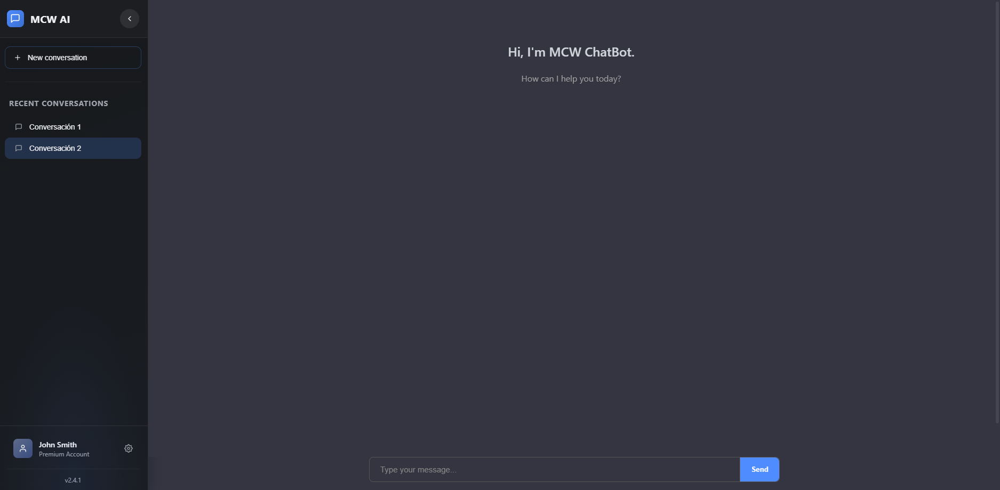

# Chatbot PDF Reader (React + FastAPI)

Una aplicación web que responde preguntas basadas en el contenido de un archivo PDF usando OpenAI y FastAPI.

---

## 🖼 Vista previa de la interfaz



---

## 🚀 Características

- 🧠 Respuestas con contexto del PDF cargado
- 💬 Chat multi-sesión con historial y exportación
- ⏱️ Streaming de respuestas en tiempo real (SSE)
- 📊 Cálculo de tokens y costo estimado por mensaje
- 📎 Exportación a Markdown
- 🧾 Markdown rendering para respuestas AI

---

## 🧪 Endpoints útiles

- `GET /health` – Verifica que el backend esté funcionando
- `POST /chat` – Enviar mensaje y obtener respuesta
- `GET /debug/chat/{conversation_id}` – Ver historial de conversación
- `DELETE /debug/conversations/{conversation_id}` – Eliminar sesión

---

## 🗂️ Estructura del proyecto

```
chatbot-pdf-reader/
├── backend/
│   ├── main.py
│   ├── utils/
│   ├── docs/
│   ├── requirements.txt
│   └── .env.example
├── frontend/
│   ├── src/
│   ├── public/
│   ├── package.json
│   └── .env.example
└── README.md
```

---

## ⚙️ Requisitos

- Node.js (>= 16)
- Python 3.10 o superior
- Cuenta de OpenAI + API Key

---

## 🔧 Instalación y ejecución local

### 1. Backend (FastAPI + OpenAI)

```bash
cd backend
pip install -r requirements.txt
python -m uvicorn main:app --host 0.0.0.0 --port 8000
```

Asegúrate de tener un archivo `.env` con tus variables reales, basado en `.env.example`.

---

### 2. Frontend (React)

```bash
cd frontend
npm install
npm start
```

Esto abrirá la app en [http://localhost:3000](http://localhost:3000)

---

## 🔐 Variables de entorno

### Backend `.env.example`

```env
OPENAI_API_KEY=sk-xxxxxxxxxxxxxxxxxxxxxxxxxxxxxxxxxxxxxxxxxxxxxxxxxxxxxxxxxxxx
PDF_PATH=backend/docs/PB_TravelAbility_DI-v3.pdf
```

### Frontend `.env.example` (opcional)

```env
REACT_APP_API_URL=http://localhost:8000
```

---

## 📦 Dependencias principales

### Backend `requirements.txt`

```txt
fastapi
uvicorn
python-multipart
python-dotenv
openai
langchain
langchain-community
langchain-openai
tiktoken
PyPDF2
faiss-cpu
numpy
```

### Frontend `package.json`

```json
"dependencies": {
  "axios": "^1.6.0",
  "react": "^18.2.0",
  "react-dom": "^18.2.0",
  "react-markdown": "^9.0.0",
  "react-scripts": "5.0.1"
}
```

---

## 📝 Notas

- El archivo PDF se carga al iniciar el backend.
- El chatbot **solo responde preguntas relacionadas con el contenido del PDF**.
- Las respuestas usan **formato Markdown** para mayor legibilidad.
- La memoria de conversación se maneja en memoria (sin base de datos).

---

## ✅ Estado del proyecto

✅ Funcional en local  
✅ Compatible con VPS o Render  
✅ Modular y extensible

---

## 📄 Licencia

MIT © 2025
